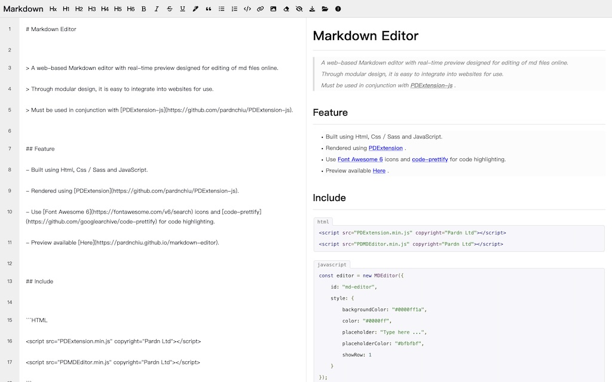

# Markdown Editor

  



## Feature

- Provides separate editor and viewer modules for independent use.
- Achieves real-time preview when the editor and viewer are used together.
- Built using HTML, CSS / Sass and JavaScript.
- Rendered using [PDExtension-js](https://github.com/pardnchiu/PDExtension-js).
- Use [Font Awesome 6](https://fontawesome.com/v6/search) icons
- Use [code-prettify](https://github.com/googlearchive/code-prettify) for code highlighting.
- Preview available [Here](https://pardnchiu.github.io/markdown-editor).

## Creator

<a href="https://pardn.io">

</a>

### Pardn Chiu 邱敬幃

[](mailto:mail@pardn.ltd) [](https://linkedin.com/in/pardnchiu) 

## License

This source code project is licensed under the GPL-3.0 license.

## How to use?

```Html
<script src="PDExtension.min.js" copyright="Pardn Ltd"></script>
<script src="PDMDEditor.min.js" copyright="Pardn Ltd"></script>
```

```Javascript
const editor = new MDEditor({
    id: "md-editor",
    style: {
        backgroundColor: "#0000ff1a", 
        color: "#0000ff", 
        placeholder: "Type here ...",
        placeholderColor: "#bfbfbf",
        showRow: 1
    }
});
const viewer = new MDViewer({ 
    id: "md-preview",
    pre: "" /* Default content. Displayed when the editor is empty. */
});

/* Add elements to the view. */
{DOM}.appendChild(editor.body);
{DOM}.appendChild(viewer.body);

/* Set the target viewer for the editor preview. */
editor.viewer = viewer; 

/* Initialize the editor and viewer. */
editor.init();
viewer.init();
```

## MDEditor

```Typescript
interface MDEditor {
    // Initialize the editor.
    init: (pre: string) => void;
    // Add heading.
    addHeading: (num: number) => void;
    // Add bold.
    addBold: () => void;
    // Add italic.
    addItalic: () => void;
    // Add strikethrough.
    addStrikethrough: () => void;
    // Add underline.
    addUnderline: () => void;
    // Add marker.
    addMarker: () => void;
    // Add blockquote.
    addBlockquote: () => void;
    // Add unordered list.
    addUl: () => void;
    // Add ordered list.
    addOl: () => void;
    // Add code block.
    addCode: () => void;
    // Add hyperlink.
    addLink: (title: string, href: string) => void;
    // Add image.
    addImage: (src: string, alt: string, title: string) => void;
    // Clear editor content.
    clear: () => void;
    // Output as Markdown file.
    downloadMd: () => void;
    // Output as HTML file.
    downloadHtml: () => void;
    // Open .md file.
    openfile: (file) => void;
};
```

## Example

- [https://pardn.io/blog/bing-dall-e-3](https://pardn.io/blog/bing-dall-e-3)

***

©️ 2023 [Pardn Chiu 邱敬幃](https://www.linkedin.com/in/pardnchiu)
