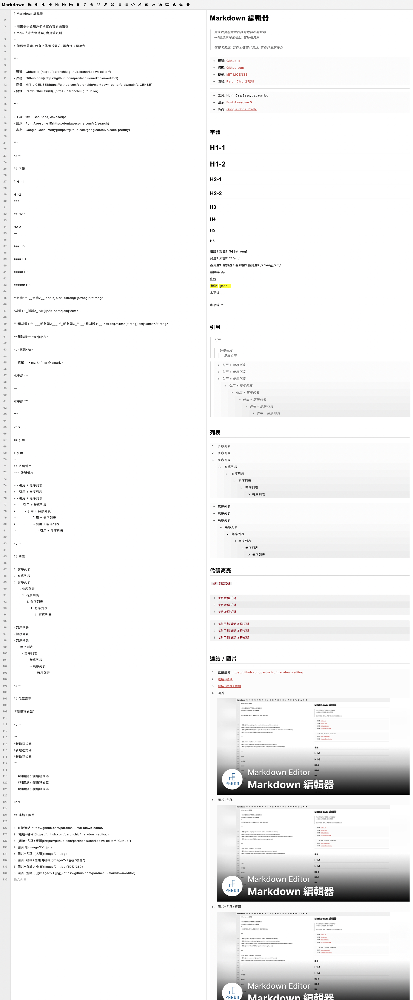

# Markdown Editor

> A web-based Markdown editor with real-time preview designed for editing of md files online. 
> Through modular design, it is easy to integrate into websites for use.
> Must be used in conjunction with [PDExtension-js](https://github.com/pardnchiu/PDExtension-js).



## Feature

- Built using Html, Css / Sass and JavaScript.
- Rendered using [PDExtension](https://github.com/pardnchiu/PDExtension-js).
- Use [Font Awesome 6](https://fontawesome.com/v6/search) icons.
- Preview available [Here](https://pardnchiu.github.io/markdown-editor).

## Include

```Html
<script src="PDExtension.min.js" copyright="Pardn Ltd"></script>
<script src="PDMDEditor.min.js" copyright="Pardn Ltd"></script>
```

```Javascript
const editor = new MDEditor({
    id: "md-editor",
    style: {
        backgroundColor: "#0000ff1a", 
        color: "#0000ff", 
        placeholder: "Type here ...",
        placeholderColor: "#bfbfbf",
        showRow: 1
    }
});
const viewer = new MDViewer({ 
    id: "md-preview",
    pre: "" /* Default content. Displayed when the editor is empty. */
});

/* Add elements to the view. */
{DOM}.appendChild(editor.body);
{DOM}.appendChild(viewer.body);

/* Set the target viewer for the editor preview. */
editor.viewer = viewer; 

/* Initialize the editor and viewer. */
editor.init();
viewer.init();
```

## MDEditor
```Typescript
interface MDEditor {
    // 初始化編輯器。
    init: (pre: string) => void;
    // 添加標題。
    addHeading: (num: number) => void;
    // 添加粗體。
    addBold: () => void;
    // 添加斜體。
    addItalic: () => void;
    // 添加刪除線。
    addStrikethrough: () => void;
    // 添加下劃線。
    addUnderline: () => void;
    // 添加標記。
    addMarker: () => void;
    // 添加引用區塊。
    addBlockquote: () => void;
    // 添加無序列表。
    addUl: () => void;
    // 添加有序列表。
    addOl: () => void;
    // 添加代碼塊。
    addCode: () => void;
    // 添加超連結。
    addLink: (title: string, href: string) => void;
    // 添加圖片。
    addImage: (src: string, alt: string, title: string) => void;
    // 清空編輯器內容。
    clear: () => void;
    // 輸出為 Markdown 文件。
    downloadMd: () => void;
    // 輸出為 HTML 文件。
    downloadHtml: () => void;
    // 開啟.md文件。
    openfile: (file) => void;
};
```

## Contributor

- [Pardn Chiu 邱敬幃](https://linkedin.com/in/pardnchiu)

## License

This source code project is licensed under the GPL-3.0 license.

***

©️ 2023 [Pardn Chiu 邱敬幃](https://www.linkedin.com/in/pardnchiu)
