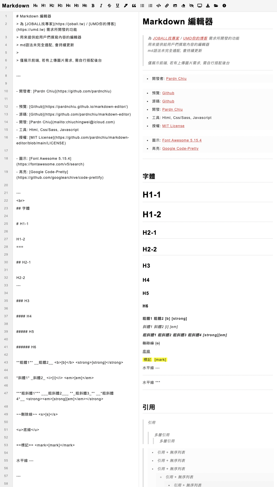

# Markdown 編輯器

> 為 [JOBALL找專家](https://joball.tw) / [UMD你的博客](https://umd.tw) 需求所開發的功能
> 
> 用來提供給用戶們撰寫內容的編輯器
> 
> md語法未完全適配, 會持續更新
>
> 僅展示前端, 若有上傳圖片需求, 需自行搭配後台

***

- 預覽: [Page](https://pardnchiu.github.io/markdown-editor/)
- 源碼: [Github](https://github.com/pardnchiu/markdown-editor)
- 授權: [MIT LICENSE](https://github.com/pardnchiu/markdown-editor/blob/main/LICENSE)
- 工具: Html, Css/Sass, Javascript
- 開發: [Pardn Chiu](mailto:chiuchingwei@icloud.com)

***

- 圖示: [Font Awesome 5.15.4](https://fontawesome.com/v5/search)
- 高亮: [Google Code Pretty](https://github.com/googlearchive/code-prettify)

***

| 預覽 |
| - |
|  |
